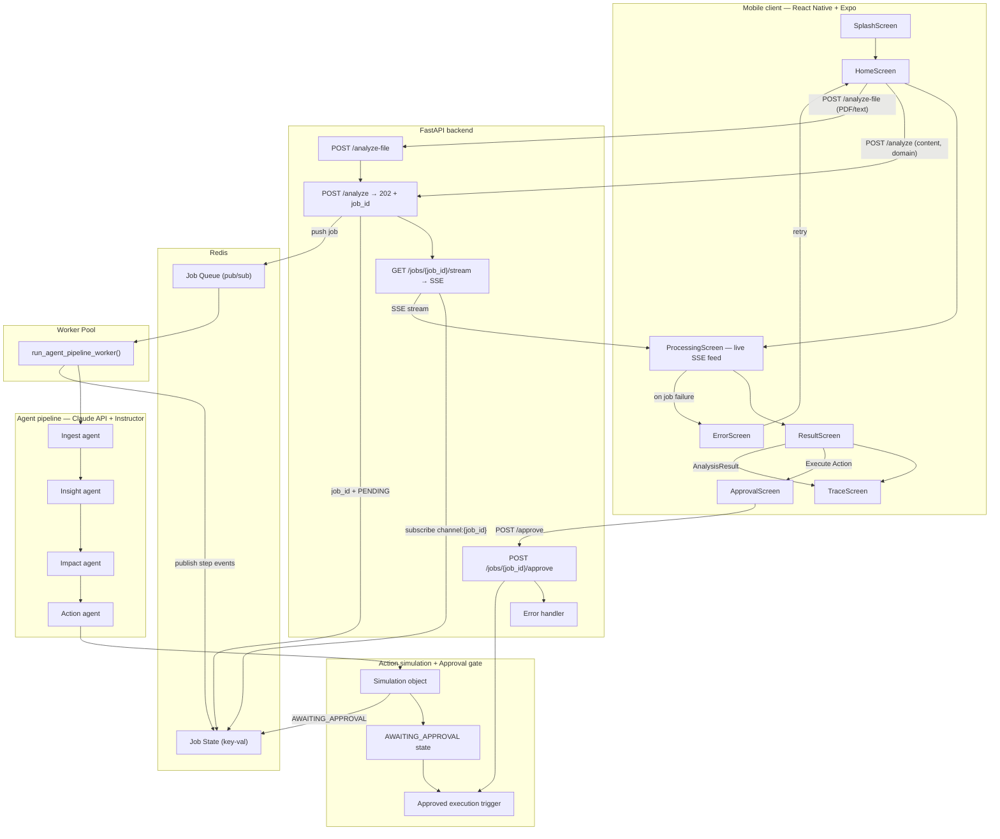
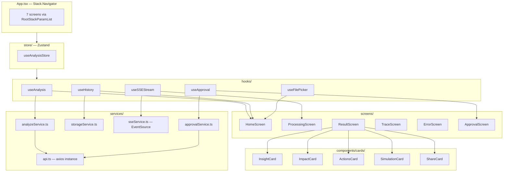

# Nexus — System Architecture

> Challenge 1 · Autonomous Content-to-Action Agent
> Stack: React Native (Expo) · FastAPI · Redis · Claude API (Anthropic) · Instructor · Zustand
> Development Environment: Google Antigravity (IDE)

---

## Table of contents

1. [Overview](#overview)
2. [System layers](#system-layers)
3. [Full system diagram](#full-system-diagram)
4. [Mobile internal diagram](#mobile-internal-diagram)
5. [Layer-by-layer breakdown](#layer-by-layer-breakdown)
   - [Mobile client (Expo)](#1-mobile-client-expo)
   - [FastAPI backend](#2-fastapi-backend)
   - [Message broker and state cache](#3-message-broker-and-state-cache-redis)
   - [Distributed worker pool](#4-distributed-worker-pool)
   - [Agent pipeline](#5-agent-pipeline)
   - [Action simulation layer](#6-action-simulation-layer)
6. [Data flow](#data-flow)
7. [Mobile internal wiring](#mobile-internal-wiring)
8. [Error handling](#error-handling)
9. [Key design decisions](#key-design-decisions)
10. [Tools and APIs used](#tools-and-apis-used)
11. [Antigravity usage guide](#antigravity-usage-guide)
12. [Assumptions and limitations](#assumptions-and-limitations)

---

## Overview

Nexus is an end-to-end **Insight → Action** system. It ingests unstructured content (text, articles, PDF reports), runs it through a four-agent sequential reasoning pipeline, and simulates the execution of a recommended action — displaying the full decision trace and real-time agent progress in a polished mobile interface.

The system was developed inside **Google Antigravity** as the IDE and development environment. The final product runs independently of Antigravity as a self-contained mobile + backend application.

The architecture follows an **Asynchronous Task Queue Pattern** combined with **Server-Sent Events (SSE)** for real-time streaming, and a **State Machine** for agent orchestration. This completely decouples the frontend request from backend agent execution — eliminating timeouts, enabling resilience to network drops, and delivering authentic real-time progress to the user.

| Layer | Technology | Responsibility |
|---|---|---|
| Mobile client | React Native · Expo · Zustand · TanStack Query | User input, real-time SSE log feed, result rendering |
| API backend | FastAPI · Python | Async job ingestion, SSE stream, human-in-the-loop approval |
| Message broker | Redis (pub/sub + key-value) | Job queue, inter-process pub/sub, job state cache |
| Worker pool | FastAPI BackgroundTasks (or Celery) | Isolated agent execution, progress publishing |
| Agent pipeline | Claude API + Instructor | Four Pydantic-validated sequential reasoning agents |
| Action simulation | In-context LLM generation | Mock API calls, notification drafts, before/after state diffs |

---

## System layers

```
                ┌────────────────────────────────────────┐
                │          Mobile Client (Expo)          │
                └───────┬────────────────────────▲───────┘
          1. POST       │                        │ 4. Stream Progress / Trace
             /analyze   │                        │    (SSE — GET /jobs/{id}/stream)
                        ▼                        │
                ┌────────────────────────────────┴───────┐
                │            FastAPI Backend             │
                │  POST /analyze  ·  GET /stream         │
                │  POST /approve  ·  GET /health         │
                └───────┬────────────────────────▲───────┘
          2. Push       │                        │ 3. Read Status /
             Job ID     ▼                        │    State Updates
                ┌────────────────────┐   ┌───────┴────────┐
                │  Message Broker    │   │ State / Cache  │
                │  Redis (pub/sub)   │   │ Redis Key-Val  │
                └───────┬────────────┘   └───────▲────────┘
                        │                        │ Write Updates
                        ▼                        │
                ┌────────────────────────────────┴───────┐
                │       Distributed Worker Pool          │
                │  (FastAPI BackgroundTasks / Celery)    │
                │                                        │
                │  Agent 1 ──> Agent 2 ──> Agent 3 ──>  │
                │  Agent 4 ──> Simulation ──> Approval   │
                └────────────────────────────────────────┘
```

---

## Full system diagram



---

## Mobile internal diagram



---

## Layer-by-layer breakdown

### 1. Mobile client (Expo)

The mobile client is a seven-screen `Stack.Navigator` application built in TypeScript. Global state is managed by **Zustand**; server state and caching by **TanStack Query (React Query)**. Screens read from the Zustand store rather than passing heavy objects through `route.params`.

#### Screens

| Screen | File | Purpose |
|---|---|---|
| `SplashScreen` | `screens/SplashScreen.tsx` | Brand animation, auto-navigates after 2.2 s |
| `HomeScreen` | `screens/HomeScreen.tsx` | Text input, domain chip selector, file picker, history list |
| `ProcessingScreen` | `screens/ProcessingScreen.tsx` | **Real-time SSE log feed** from actual agent step completions, animated progress bar |
| `ResultScreen` | `screens/ResultScreen.tsx` | Five-card scrollable result view + "Execute Action" CTA |
| `ApprovalScreen` | `screens/ApprovalScreen.tsx` | Human-in-the-loop gate — displays recommended action, confirms execution |
| `TraceScreen` | `screens/TraceScreen.tsx` | Expandable agent decision log (reasoning + key_decisions), JSON export |
| `ErrorScreen` | `screens/ErrorScreen.tsx` | Friendly error display with retry navigation back to HomeScreen |

#### Global state (Zustand)

```typescript
// store/useAnalysisStore.ts
import { create } from 'zustand';

interface AnalysisState {
  currentJobId: string | null;
  logs: string[];
  analysisResult: AnalysisResult | null;
  jobStatus: 'IDLE' | 'PENDING' | 'RUNNING' | 'AWAITING_APPROVAL' | 'COMPLETED' | 'FAILED';
  setCurrentJobId: (id: string | null) => void;
  addLog: (log: string) => void;
  setResult: (result: AnalysisResult) => void;
  setJobStatus: (status: AnalysisState['jobStatus']) => void;
  reset: () => void;
}

export const useAnalysisStore = create<AnalysisState>((set) => ({
  currentJobId: null,
  logs: [],
  analysisResult: null,
  jobStatus: 'IDLE',
  setCurrentJobId: (id) => set({ currentJobId: id }),
  addLog: (log) => set((state) => ({ logs: [...state.logs, log] })),
  setResult: (result) => set({ analysisResult: result }),
  setJobStatus: (status) => set({ jobStatus: status }),
  reset: () => set({ currentJobId: null, logs: [], analysisResult: null, jobStatus: 'IDLE' }),
}));
```

#### Hooks

| Hook | Responsibility |
|---|---|
| `useAnalysis` | Posts to `POST /analyze`, receives `job_id`, writes to Zustand store, navigates to `ProcessingScreen` |
| `useSSEStream` | Opens `EventSource` on `GET /jobs/{job_id}/stream`, parses events, feeds logs and final result into Zustand store in real time. Auto-reconnects with exponential backoff on disconnect. |
| `useHistory` | Reads and writes past analysis runs to `AsyncStorage` |
| `useFilePicker` | Wraps `expo-document-picker`, extracts text, passes to `useAnalysis` |
| `useApproval` | Posts to `POST /jobs/{job_id}/approve`, updates job status in Zustand store |

#### Components

**Cards** (result-screen-specific):

| Component | What it renders |
|---|---|
| `InsightCard` | Insight bullet list with confidence badge (HIGH / MEDIUM / LOW) |
| `ImpactCard` | Animated fill bars per impact dimension with severity label |
| `ActionsCard` | Ranked action rows with priority badges and "Execute Action →" CTA |
| `SimulationCard` | Dark-bg JSON code block, notification draft, before/after diff table, execution log |
| `ShareCard` | Share report, view trace, save, run-again buttons |

**UI primitives** (reused across all screens):

`AgentStep` · `ImpactBar` · `CodeBlock` · `DiffRow` · `DomainChip` · `PriorityBadge` · `ConfidenceBadge` · `SectionHeader` · `PrimaryButton` · `SecondaryButton` · `LogLine` · `StatusBadge`

#### Services

| File | Responsibility |
|---|---|
| `services/api.ts` | Axios instance with base URL from `.env`, 30 s timeout, error-normalisation interceptor |
| `services/analyzeService.ts` | `postAnalyze(content, domain): Promise<{ job_id: string }>` |
| `services/sseService.ts` | `createEventSource(jobId, onMessage, onError): EventSource` |
| `services/approvalService.ts` | `approveJob(jobId): Promise<void>` |
| `services/storageService.ts` | `saveHistory()`, `loadHistory()`, `clearHistory()` via AsyncStorage |

---

### 2. FastAPI backend

The backend exposes four endpoints. The critical design principle: `POST /analyze` returns **immediately** with a `202 Accepted` and a `job_id`. It never blocks while agents are running.

#### Endpoints

```
POST  /analyze                   → 202 Accepted + { job_id, status: "PENDING" }
POST  /analyze-file              → extracts text, delegates to /analyze internally
GET   /jobs/{job_id}/stream      → SSE stream of real-time agent progress + final result
POST  /jobs/{job_id}/approve     → triggers approved action execution
GET   /health                    → { status: "ok" }
```

#### Async job ingestion

```python
# backend/main.py
from fastapi import FastAPI, BackgroundTasks, status
from pydantic import BaseModel
from typing import Literal
import uuid, redis.asyncio as aioredis

app = FastAPI()
redis_client = aioredis.from_url("redis://localhost")

class AnalyzeRequest(BaseModel):
    content: str
    domain: Literal["business", "policy", "logistics", "finance", "news"]

@app.post("/analyze", status_code=status.HTTP_202_ACCEPTED)
async def analyze_async(request: AnalyzeRequest, background_tasks: BackgroundTasks):
    job_id = str(uuid.uuid4())
    await redis_client.set(f"job:{job_id}:status", "PENDING")
    background_tasks.add_task(
        run_agent_pipeline_worker, job_id, request.content, request.domain
    )
    return {"job_id": job_id, "status": "PENDING"}
```

#### SSE stream endpoint

```python
# backend/stream.py
from fastapi.responses import StreamingResponse
import asyncio

@app.get("/jobs/{job_id}/stream")
async def stream_job_updates(job_id: str):
    async def event_generator():
        pubsub = redis_client.pubsub()
        await pubsub.subscribe(f"channel:{job_id}")
        while True:
            message = await pubsub.get_message(ignore_subscribe_messages=True)
            if message:
                data = message['data'].decode('utf-8')
                yield f"data: {data}\n\n"
                if "COMPLETED" in data or "FAILED" in data:
                    break
            await asyncio.sleep(0.3)
    return StreamingResponse(event_generator(), media_type="text/event-stream")
```

#### Human-in-the-loop approval endpoint

```python
@app.post("/jobs/{job_id}/approve")
async def approve_action(job_id: str):
    current = await redis_client.get(f"job:{job_id}:status")
    if current != b"AWAITING_APPROVAL":
        raise HTTPException(400, detail={"error": "invalid_state_transition"})
    await redis_client.set(f"job:{job_id}:status", "EXECUTING")
    # Plug real integrations here: SendGrid, Jira, CRM, etc.
    await redis_client.publish(f"channel:{job_id}", '{"event": "EXECUTING"}')
    return {"status": "EXECUTING"}
```

#### Domain validation

The `domain` field is enforced as a Pydantic `Literal`. Invalid values return `HTTP 422` immediately — no job is created and no worker is spawned.

---

### 3. Message broker and state cache (Redis)

Redis serves two roles simultaneously:

**Pub/sub broker** — the worker publishes a JSON event to `channel:{job_id}` after every agent step. The SSE endpoint subscribes and forwards each event to the mobile client as it arrives.

**Key-value state cache** — job status (`PENDING` → `RUNNING` → `AWAITING_APPROVAL` → `COMPLETED` / `FAILED`) is stored at `job:{job_id}:status`. The approval endpoint reads and writes this key to enforce the execution gate.

#### Event schema

Per-step event (published after each agent completes):

```json
{
  "event": "STEP_COMPLETE",
  "agent": "Impact agent",
  "output_summary": "Identified 3 high-severity impacts on regional logistics",
  "reasoning": "Cross-referenced fuel cost signal with delivery SLA commitments",
  "key_decisions": ["Flagged delivery margin compression as HIGH severity"],
  "progress": 75
}
```

Terminal events:

```json
{ "event": "COMPLETED",          "result": { /* full AnalysisResult */ } }
{ "event": "FAILED",             "error": "string" }
{ "event": "AWAITING_APPROVAL",  "recommended_action": "string" }
{ "event": "EXECUTING" }
```

---

### 4. Distributed worker pool

The worker is an async Python function run by FastAPI's `BackgroundTasks`. The function signature is identical to a Celery task — migrating to true distributed workers in production requires only adding the `@celery.task` decorator.

```python
# backend/worker.py
async def run_agent_pipeline_worker(job_id: str, content: str, domain: str):
    await redis_client.set(f"job:{job_id}:status", "RUNNING")

    ingest_out  = await run_ingest_agent(content)
    await publish_step(job_id, "Ingest agent",  ingest_out,  progress=25)

    insight_out = await run_insight_agent(ingest_out)
    await publish_step(job_id, "Insight agent", insight_out, progress=50)

    impact_out  = await run_impact_agent(insight_out)
    await publish_step(job_id, "Impact agent",  impact_out,  progress=75)

    action_out  = await run_action_agent(impact_out, domain)
    await publish_step(job_id, "Action agent",  action_out,  progress=95)

    # Pause for human approval before executing any real action
    await redis_client.set(f"job:{job_id}:status", "AWAITING_APPROVAL")
    await redis_client.publish(f"channel:{job_id}", json.dumps({
        "event": "AWAITING_APPROVAL",
        "recommended_action": action_out.recommended_actions[0].action,
        "result": assemble_result(ingest_out, insight_out, impact_out, action_out)
    }))

async def publish_step(job_id: str, agent_name: str, output, progress: int):
    event = json.dumps({
        "event": "STEP_COMPLETE",
        "agent": agent_name,
        "output_summary": output.summary,
        "reasoning": output.reasoning,
        "key_decisions": output.key_decisions,
        "progress": progress
    })
    await redis_client.publish(f"channel:{job_id}", event)
```

---

### 5. Agent pipeline

Four sequential Claude API calls wrapped with **Instructor** for bulletproof Pydantic-validated JSON. Each agent receives the previous agent's output as its input, grounding every downstream step in real upstream reasoning.

```
Input content
     │
     ▼
┌─────────────────────────────────────────┐
│  Ingest agent                           │
│  Output: IngestOutput (Pydantic)        │
│  Max tokens: 1 000                      │
└─────────────────────┬───────────────────┘
                      │
                      ▼
┌─────────────────────────────────────────┐
│  Insight agent                          │
│  Output: InsightOutput (Pydantic)       │
│  Max tokens: 1 000                      │
└─────────────────────┬───────────────────┘
                      │
                      ▼
┌─────────────────────────────────────────┐
│  Impact agent                           │
│  Output: ImpactOutput (Pydantic)        │
│  Max tokens: 1 200                      │
└─────────────────────┬───────────────────┘
                      │
                      ▼
┌─────────────────────────────────────────┐
│  Action agent                           │
│  Output: ActionOutput (Pydantic)        │
│  Max tokens: 2 500                      │
└─────────────────────────────────────────┘
```

Model: `claude-sonnet-4-20250514`

#### Instructor integration — bulletproof JSON

Instructor wraps the Anthropic client and enforces Pydantic schemas natively via Claude's tool-calling API. If the response doesn't match the schema, Instructor automatically retries — eliminating the entire class of JSON parse errors that manual `json.loads()` + fence-stripping is vulnerable to.

```python
# backend/agents.py
import instructor
from anthropic import Anthropic
from pydantic import BaseModel
from typing import Literal

client = instructor.from_anthropic(Anthropic())

class IngestOutput(BaseModel):
    facts: list[str]
    entities: list[str]
    signals: list[str]
    summary: str
    reasoning: str
    key_decisions: list[str]

class InsightOutput(BaseModel):
    insights: list[str]
    confidence: Literal["high", "medium", "low"]
    summary: str
    reasoning: str
    key_decisions: list[str]

class ImpactItem(BaseModel):
    insight: str
    consequence: str
    severity: Literal["high", "medium", "low"]

class ImpactOutput(BaseModel):
    impacts: list[ImpactItem]
    summary: str
    reasoning: str
    key_decisions: list[str]

class ActionItem(BaseModel):
    action: str
    rationale: str
    priority: Literal["high", "medium", "low"]

class SimulationObject(BaseModel):
    action_taken: str
    mock_api_call: dict
    notification_draft: str
    before_state: dict
    after_state: dict
    execution_log: list[str]

class ActionOutput(BaseModel):
    recommended_actions: list[ActionItem]
    simulation: SimulationObject
    summary: str
    reasoning: str
    key_decisions: list[str]

async def run_ingest_agent(content: str) -> IngestOutput:
    return client.messages.create(
        model="claude-sonnet-4-20250514",
        max_tokens=1000,
        response_model=IngestOutput,
        messages=[{"role": "user", "content": content}]
    )
```

#### Trace enrichment

The orchestrator assembles `trace[]` from each agent's `summary`, `reasoning`, and `key_decisions` — all guaranteed present by Pydantic:

```json
{
  "step": "Impact agent",
  "output_summary": "Identified 3 high-severity impacts on regional logistics",
  "reasoning": "Cross-referenced fuel cost signal with delivery SLA commitments to derive severity",
  "key_decisions": [
    "Flagged 'delivery margin compression' as HIGH severity",
    "Deprioritised brand perception as MEDIUM given short news cycle"
  ]
}
```

---

### 6. Action simulation layer

The action agent generates a complete `SimulationObject` as part of its Pydantic-validated output. No real external API calls are made. The object is rendered on `SimulationCard` as:

- A dark-background code block: mock API `POST` request and `200 OK` response
- A plain-text notification draft (email or SMS, domain-appropriate)
- A before/after diff table with domain-scoped field names (`discount_rate`, `delivery_price`, `alert_threshold`, etc.)
- A staggered execution log list

After the simulation is shown on `ResultScreen`, the **ApprovalScreen** gives the user a physical "Execute Action" button. Tapping it calls `POST /jobs/{job_id}/approve`, which sets job status to `EXECUTING` and triggers real downstream integrations (SendGrid, Jira, CRM — pluggable per domain).

---

## Data flow

```
User types content + selects domain
        │
        ▼
HomeScreen → useAnalysis.runAnalysis()
        │
        ▼
analyzeService.postAnalyze() → POST /analyze
        │
        ├── invalid domain → HTTP 422 → ErrorScreen immediately
        │
        ▼
FastAPI: job_id created · PENDING written to Redis · worker spawned
202 Accepted + { job_id } returned to mobile in < 100 ms
        │
        ▼
Zustand: currentJobId = job_id · jobStatus = PENDING
        │
        ▼
ProcessingScreen mounts → useSSEStream opens EventSource
        GET /jobs/{job_id}/stream (SSE)
        │
        ▼
Worker runs 4 agents sequentially
After each agent completes:
  → publish STEP_COMPLETE event to Redis channel
  → SSE endpoint forwards event to mobile in real time
  → useSSEStream: addLog() · update progress bar
        │
        ▼
After Action agent:
  → worker publishes AWAITING_APPROVAL + full AnalysisResult
  → useSSEStream: setResult() · setJobStatus("AWAITING_APPROVAL")
  → ProcessingScreen navigates to ResultScreen
        │
        ▼
ResultScreen reads analysisResult from Zustand store
User taps "Execute Action" → navigates to ApprovalScreen
        │
        ▼
ApprovalScreen shows recommended action + rationale
User taps "Confirm" → useApproval → POST /jobs/{job_id}/approve
        │
        ▼
Backend: status = EXECUTING · publishes EXECUTING event
ApprovalScreen: shows execution confirmation log
        │
        ▼
TraceScreen: reads trace[] from Zustand · renders enriched decision log
```

---

## Mobile internal wiring

Architectural rule: **screens never import `axios` directly and never depend on `route.params` for result data**. The dependency chain is:

```
Screen → hook → Zustand store ← service ← api.ts ← FastAPI
```

SSE events flow directly into the Zustand store via `useSSEStream`, making `ProcessingScreen` a pure reactive subscriber with no polling or timers.

```
HomeScreen
  uses → useAnalysis   (POST /analyze, writes job_id + PENDING to store)
  uses → useHistory    (loads past runs from AsyncStorage)
  uses → useFilePicker (optional PDF → text extraction)

ProcessingScreen
  uses → useSSEStream  (SSE → real-time STEP_COMPLETE events → addLog + progress)
  reads → store        (logs[], jobStatus, progress)
  on AWAITING_APPROVAL → navigates to ResultScreen
  on FAILED            → navigates to ErrorScreen

ErrorScreen
  reads → store        (error message)
  renders              → descriptive message + Retry → HomeScreen + store.reset()

ResultScreen
  reads → store        (analysisResult)
  renders              → InsightCard, ImpactCard, ActionsCard, SimulationCard, ShareCard
  "Execute Action"     → navigates to ApprovalScreen

ApprovalScreen
  reads → store        (currentJobId, recommended_actions[0])
  uses  → useApproval  (POST /jobs/{id}/approve)
  on confirm           → shows EXECUTING confirmation

TraceScreen
  reads → store        (analysisResult.trace[])
  renders              → AgentStep per step, expandable (reasoning + key_decisions)
  exports              → trace JSON via expo-sharing
```

---

## Error handling

### Mobile

| Failure | Behaviour |
|---|---|
| Invalid domain (HTTP 422) | Caught in `useAnalysis`; written to store; `ErrorScreen` shown immediately — no job created |
| SSE connection lost mid-stream | `useSSEStream` auto-reconnects with exponential backoff (3 attempts); on final failure navigates to `ErrorScreen` |
| `FAILED` event received over SSE | `useSSEStream` sets `jobStatus = FAILED`; navigates to `ErrorScreen` with agent error message |
| Approval `POST` fails | Inline error on `ApprovalScreen`; user retries without re-running the pipeline |
| `AsyncStorage` read failure | `useHistory` returns empty array; silent fail; no crash |
| File picker cancel | `useFilePicker` returns `null`; no navigation; no error shown |

### Backend

| Failure | HTTP / SSE Event | Detail |
|---|---|---|
| Invalid domain | HTTP 422 | Pydantic validation error; no job created |
| Agent schema validation failure | SSE `FAILED` event | Instructor retries once automatically; on second failure publishes `FAILED` |
| Claude API rate limit / timeout (retry exhausted) | SSE `FAILED` event | `{ "error": "upstream_unavailable" }` |
| Approve non-pending job | HTTP 400 | `{ "error": "invalid_state_transition" }` |
| File > 5 MB | HTTP 413 | `{ "error": "file_too_large" }` |
| Empty extracted text | HTTP 400 | `{ "error": "empty_content" }` |

---

## Key design decisions

**Async job pattern — no blocking HTTP.** `POST /analyze` returns in under 100 ms with a `job_id`. All agent execution happens in a background worker. This eliminates mobile timeout errors entirely and makes the architecture resilient to network drops — the worker continues even if the phone briefly loses connectivity.

**SSE over WebSockets.** SSE is unidirectional (server → client), which is all the progress stream requires. It works natively with `EventSource` on React Native, requires no additional libraries, and is significantly simpler to operate than a full WebSocket server.

**Instructor over manual JSON parsing.** Instructor wraps Claude's tool-calling API to enforce Pydantic schemas natively, with automatic retry on schema violations. This eliminates the entire class of `422 parse failure` errors that manual `json.loads()` + fence-stripping is vulnerable to.

**Zustand over `route.params`.** Route params are limited to serialisable primitives and create implicit coupling between screens. Zustand gives every screen direct access to the same `AnalysisResult` object with zero serialisation overhead and makes the SSE event feed trivially reactive across the entire app.

**Human-in-the-loop approval gate.** The Action agent transitions the job to `AWAITING_APPROVAL` rather than executing immediately. The user explicitly confirms on `ApprovalScreen` before any real integration is triggered. This satisfies the hackathon's "simulated execution" requirement while also demonstrating a production-safe agentic pattern that judges will recognise.

**Sequential agents, not parallel.** Each agent's output feeds the next. Impact analysis is grounded in real insights; action recommendations are grounded in real impacts — not independently hallucinated chains.

**Action agent has the highest token budget (2 500).** It must produce `recommended_actions[]` plus a complete `SimulationObject`. Lower budgets risk mid-JSON truncation of the simulation block.

**Domain-scoped before/after state.** The action agent prompt includes a domain-specific skeleton for `before_state` / `after_state`, ensuring the diff table always renders meaningful field names rather than generic placeholders.

**Enriched trace schema.** Every agent Pydantic model includes `summary`, `reasoning`, and `key_decisions[]`. The trace is assembled from these guaranteed fields — it is always complete and never empty.

---

## Tools and APIs used

| Tool / API | Purpose |
|---|---|
| Anthropic Claude API (`claude-sonnet-4-20250514`) | All four reasoning agents |
| Instructor (`instructor` Python library) | Pydantic-enforced JSON output from Claude; automatic retry on schema mismatch |
| FastAPI + Uvicorn | Async HTTP server, SSE streaming, request routing, validation |
| Pydantic | Request/response validation; domain `Literal` enforcement; all agent output schemas |
| Redis (`redis-py` async) | Job queue pub/sub; job state key-value cache |
| Zustand | Global client-side state management on mobile |
| TanStack Query (React Query) | Server state, caching, and background refetch on mobile |
| Expo SDK | React Native runtime, file system, sharing |
| expo-document-picker | PDF and text file upload |
| expo-file-system + expo-sharing | Trace JSON export |
| AsyncStorage | Local history persistence |
| axios | HTTP client in mobile (with timeout + error interceptor) |
| PyPDF2 | PDF text extraction in backend |
| Google Antigravity | **Development environment (IDE)** used to build, run, and test the system. The final product runs independently and has no runtime dependency on Antigravity. |

---

## Antigravity usage guide

> This section documents exactly how to use Google Antigravity as the IDE to build Nexus within the hackathon window. Follow these steps in order.

### Project structure in Antigravity

```
nexus/
├── backend/
│   ├── main.py           ← endpoints: /analyze, /stream, /approve, /health
│   ├── worker.py         ← run_agent_pipeline_worker()
│   ├── agents.py         ← Instructor-wrapped Claude agent functions + Pydantic models
│   ├── models.py         ← shared Pydantic schemas (request/response)
│   └── requirements.txt
├── mobile/
│   ├── App.tsx
│   ├── screens/
│   ├── store/            ← Zustand store
│   ├── hooks/
│   ├── services/
│   └── components/
└── docker-compose.yml    ← Redis only
```

### Step 1 — Spin up Redis

Open a terminal in Antigravity and run:

```bash
docker-compose up -d redis
```

Verify Redis is alive:

```bash
redis-cli ping   # → PONG
```

All job state and pub/sub runs through `localhost:6379`. Keep this terminal visible — you will use `redis-cli SUBSCRIBE` to watch events during development.

### Step 2 — Install backend dependencies

```bash
cd backend
pip install fastapi uvicorn redis instructor anthropic pydantic pypdf2 python-multipart
```

Add all packages to `requirements.txt`. Start the server with hot-reload:

```bash
uvicorn main:app --reload --port 8000
```

Confirm the health check:

```bash
curl localhost:8000/health   # → { "status": "ok" }
```

### Step 3 — Build and test the agent pipeline in isolation

Before wiring any UI, verify the full 4-agent pipeline works end-to-end. In a second Antigravity terminal, subscribe to the Redis channel:

```bash
redis-cli SUBSCRIBE "channel:test-job-1"
```

In a third terminal, trigger the worker directly:

```bash
python -c "
import asyncio
from worker import run_agent_pipeline_worker
asyncio.run(run_agent_pipeline_worker(
    'test-job-1',
    'Fuel prices rose 20% this week. Delivery companies are raising rates.',
    'logistics'
))
"
```

You should see four `STEP_COMPLETE` events followed by `AWAITING_APPROVAL` arrive in the subscriber terminal. If any agent fails, the `FAILED` event will include the Instructor retry error — fix the Pydantic model first, then re-test before touching the mobile code.

### Step 4 — Test the SSE endpoint with curl

```bash
curl -N http://localhost:8000/jobs/test-job-1/stream
```

You should see the same events streaming as `data: {...}` lines. This confirms the SSE layer is working before the mobile app is connected.

### Step 5 — Install and start the mobile app

Open a fourth Antigravity terminal:

```bash
cd mobile
npm install
npx expo start
```

Create `mobile/.env`:

```bash
# For simulator (same machine)
EXPO_PUBLIC_API_URL=http://localhost:8000

# For physical device (replace with your machine's local IP)
EXPO_PUBLIC_API_URL=http://192.168.x.x:8000
```

Use Expo Go on your phone or the Antigravity simulator. The app should load on the `SplashScreen` and navigate to `HomeScreen`.

### Step 6 — End-to-end smoke test

Use this exact scenario — it reliably produces strong, domain-specific output and makes a compelling demo:

> **Input:** *"Pakistan has raised petrol prices by Rs 25 per litre effective immediately. Logistics companies operating in Punjab are reporting a 15% increase in operational costs. Several courier services have already announced delivery surcharge increases."*
> **Domain:** `logistics`

Expected flow:
1. `HomeScreen` — paste input, select "logistics", tap Analyze
2. `ProcessingScreen` — log lines arrive live from actual agent completions (not a timer)
3. After ~6–8 s — navigates to `ResultScreen`
4. `ResultScreen` — all five cards render with real data
5. `SimulationCard` — before/after diff table shows `delivery_price`, `surcharge_rate`, `margin_pct` fields
6. Tap "Execute Action" → `ApprovalScreen` shows recommended action
7. Tap "Confirm" → execution log appears with `EXECUTING` status
8. Tap "View Trace" → `TraceScreen` shows all four agents with `reasoning` and `key_decisions` expanded

### Step 7 — Rapid iteration loop

| What you changed | How to reload |
|---|---|
| Backend endpoint or agent prompt | `uvicorn --reload` picks it up automatically — no restart |
| Pydantic model | Same — hot reload. Re-run the Step 3 isolation test to verify |
| Mobile screen or component | Expo Fast Refresh — reflects in < 2 s on connected device |
| Zustand store shape | Fast Refresh — but clear AsyncStorage if history schema changed |
| Redis event schema | Update both `worker.py` (publisher) and `useSSEStream.ts` (consumer) together |

### Step 8 — Redis inspection commands

Use these during development to debug job state:

```bash
# List all active jobs
redis-cli KEYS "job:*"

# Check a specific job's status
redis-cli GET "job:{job_id}:status"

# Watch live events for a job
redis-cli SUBSCRIBE "channel:{job_id}"

# Clear all job state (reset between tests)
redis-cli FLUSHDB
```

### Step 9 — Pre-demo checklist

Run this checklist in Antigravity before presenting:

- [ ] `redis-cli ping` → `PONG`
- [ ] `curl localhost:8000/health` → `{ "status": "ok" }`
- [ ] Full end-to-end smoke test with the petrol price / logistics scenario passes
- [ ] `ProcessingScreen` log lines arrive one-by-one (not all at once) — confirms SSE is live
- [ ] `SimulationCard` before/after diff table shows domain-relevant field names (not generic keys)
- [ ] `TraceScreen` shows `reasoning` and `key_decisions` populated for all 4 agents
- [ ] `ApprovalScreen` "Confirm" button triggers `EXECUTING` event and shows the confirmation log
- [ ] Trace JSON export from `TraceScreen` via share sheet works on the demo device

### Environment variables reference

```bash
# backend/.env
ANTHROPIC_API_KEY=sk-ant-...
REDIS_URL=redis://localhost:6379

# mobile/.env
EXPO_PUBLIC_API_URL=http://<machine-ip>:8000
```

---

## Assumptions and limitations

- **No authentication.** The backend has no API key or user session. Suitable for a hackathon demo; not production-ready.
- **BackgroundTasks, not Celery.** The worker uses FastAPI's built-in `BackgroundTasks` for simplicity (single process). Migrating to Celery for true distributed workers requires only adding `@celery.task` — all agent logic is unchanged.
- **In-process Redis.** Redis runs locally via Docker. For production, swap the connection string for a managed instance (Redis Cloud, AWS ElastiCache).
- **Simulation is LLM-generated, not real.** No real CRM, database, or email system is contacted during the demo. The `POST /approve` endpoint triggers a stub — replace with SendGrid, Jira, or any CRM adapter per domain.
- **SSE reconnection is client-side.** `useSSEStream` retries with exponential backoff on disconnect. The backend worker continues regardless; the client resyncs by polling `GET /jobs/{id}/status` on reconnect.
- **PDF extraction quality.** `PyPDF2` handles text-layer PDFs well but struggles with scanned documents. OCR is out of scope.
- **English primary.** Agent prompts are in English. Roman Urdu or Urdu input is processed but agent output is in English.
- **Single domain per request.** Multi-domain analysis would require parallel worker pipelines.
- **Antigravity is the IDE, not a runtime dependency.** The entire system — mobile app, FastAPI backend, Redis, and Claude API calls — runs independently of Antigravity. Antigravity was used exclusively as the development, execution, and testing environment during the build phase.
